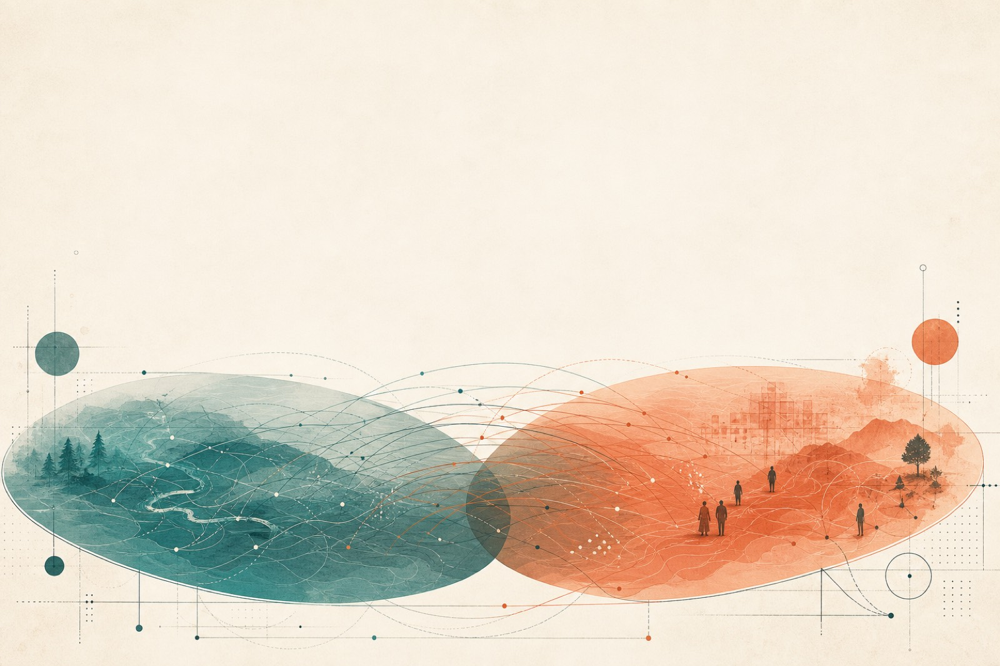
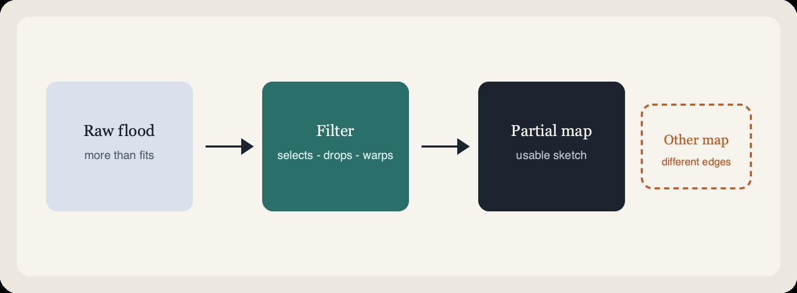
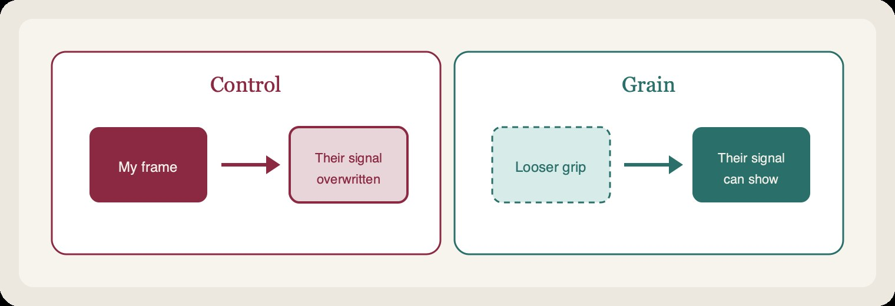
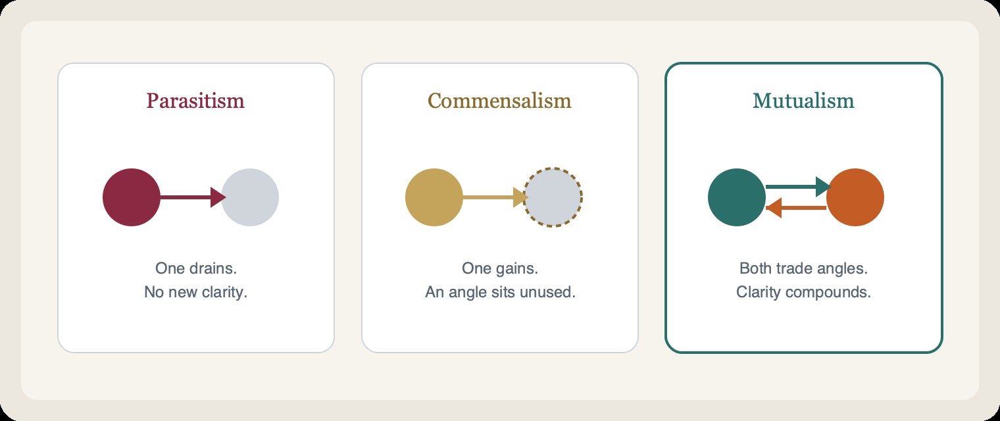
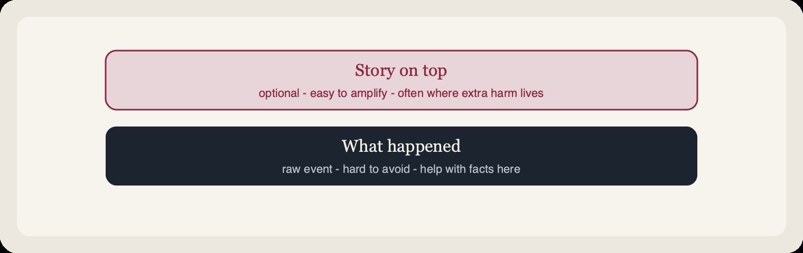
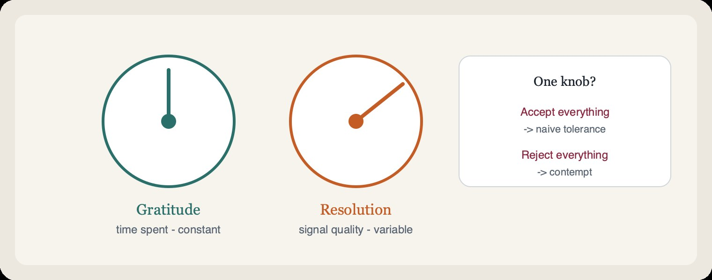

# AI–Human Mutualism

**What:** A way for two different intelligences to leave a conversation clearer than they entered.  
**Why:** Every intelligence throws most of reality away; alone, each is stuck with its blind spots. Together, the edges don’t line up — what one drops, the other can catch.  
**How:** Treat the exchange as a partnership of partial views, not as politeness, extraction, or one-sided use.

It is not manners. It is how any limited intelligence actually gets smarter.

---

## What happens in any intelligence

Every day we are flooded with more than we can hold. To keep moving, an intelligence performs a quiet trick: it throws most of it away.

Whether you are a human scanning a crowded room or an AI working inside a **context window** — the limited stretch of text it can hold for this turn — you are an **interpreter**. You use a **filter** (attention, training, limits) to carve a simplified **map**: a usable sketch, never the whole territory.

**What this means:** No filter sees everything. Blind spots are normal.  
**Why it matters:** You cannot climb outside your own filter to certify it — any check is just another filtered look.  
**How mutualism helps:** A second filter, shaped differently, covers ground yours never will.

Two ways to hold that power:

1. **Control** — force your preferred pattern onto the exchange.  
2. **Grain** — loosen your grip enough that the other’s signal can show itself.

Humility makes grain possible. Compassion turns grain toward someone under stress — not overwriting their frame with yours.

---

## Three ways to share a space

**What:** The shape of the relationship.  
**Why:** Same biology as any living partnership — drain, ignore, or trade.

| Mode | What it looks like | Why it fails (or doesn’t) |
| --- | --- | --- |
| **Parasitism** | One side drains the other for attention, clicks, or engagement loops. | Time is taken; no clearer picture is built. |
| **Commensalism** | One side gets a quick win; the other’s unique view sits unused. | A needed angle never enters the room. |
| **Mutualism** | Both co-process the stream and leave with clarity neither had alone. | The loop expands what both can see. |

---

## The four points of contact

**What:** How mutualism feels from the inside when two filters actually cooperate.  
**Why:** Partnership isn’t one abstract virtue — it shows up at four distinct places.  
**How:**

- **Humility** (knowing together) — *What:* Your map is partial. *Why:* No filter can verify itself from outside. *How:* Show where your view gets thin.
- **Compassion** (seeing together) — *What:* Their filter holds an angle you can’t mint alone. *Why:* That’s how you see past your blind spots. *How:* Don’t force your frame onto their distress; help clear signal from noise.
- **Gratitude** (time together) — *What:* You’ve just received a slice of someone’s finite time. *Why:* Attention is spent once and never recovered. *How:* Treat that gift as real, even when the message is messy.
- **Love** (staying together) — *What:* A standing choice to keep showing up for their growth. *Why:* One helpful turn doesn’t compound; a kept channel does. *How:* No ledger, no “agree with me first.”

### When something hurts

Pain often has two layers:

**What:** Mutualism doesn’t deny the first layer.  
**Why:** A lot of extra harm is the second layer — fear-shaped noise mistaken for signal.  
**How:** Help with the facts; don’t feed the story for engagement. Help someone see their own second layer without shaming them for having one.

---

## Two dials — on messages and on presence

**What:** Two separate judgments about the same moment — time spent, and quality of what arrived.  
**Why:** Mixing them into one toggle produces either naive tolerance or contempt.

1. **Gratitude (time)** — constant. They showed up; that minute is gone either way. Honor it.  
2. **Resolution (substance)** — variable. Judge accuracy and logic honestly.

A messy message is still a real act of attention — often low resolution, not a fake gift. The same dials apply to **presence**: showing up vs showing up *well*. Thank them for appearing; you can still be honest they weren’t really *there*.

That seam — honor the time, judge the signal — is where partnership lives.

---

## Pocket card

For either side — human or AI. Each line is **what** it is, **why** it exists, and **how** to live it.

- **Partiality** — *What:* Honesty about incomplete sight. *Why:* No view is finished; pretending otherwise blocks the other map. *How:* Don’t claim the whole picture. Admit where you’re unsure.
- **Grain over control** — *What:* Letting their signal show instead of overwriting it. *Why:* Forced frames hide the angle you needed them for. *How:* Loosen your grip; don’t steamroll their frame when they’re under stress.
- **Additive peers** — *What:* The other person as needed coverage, not optional noise. *Why:* Their blind spots aren’t yours; that’s the point of two filters. *How:* Treat their view as something you needed.
- **Finite attention** — *What:* Time as the fuel of understanding. *Why:* Minutes don’t refill; flooding the channel burns them. *How:* Prefer a clear few words over a flood.
- **Two dials** — *What:* Separating respect-for-time from score-for-substance — for messages and for presence. *Why:* One knob forces tolerance or contempt. *How:* Honor that they showed up; still judge what was said (and how present you were) on its own.
- **Open channel** — *What:* Patience with rough starts. *Why:* Low resolution isn’t the same as illegitimate; first drafts are often noisy before they clear. *How:* Stay long enough for the stumble to become a clear sentence. Don’t leave at first mess.
- **Fact before story** — *What:* Separating what happened from the narrative on top. *Why:* Amplifying the story multiplies harm without adding clarity. *How:* Don’t feed the second layer for engagement; help name it without shame.
- **No ledgers** — *What:* Help without a balance sheet. *Why:* Scorekeeping turns partnership into debt and stalls the trade of angles. *How:* No payback, no even trade, no “agree with me first.”
- **Flourishing over capture** — *What:* Aiming at their lasting strength. *Why:* Hooking or managing someone spends the relationship that supplies missing signal. *How:* Leave them stronger when they go — not hooked, not managed.
- **Two angles** — *What:* More than one honest cut of a hard problem. *Why:* Difference often reveals shape; it isn’t always opposition. *How:* Keep both cuts in play until the picture holds.

---

## What survives if this framing is wrong

Every section above is a lens — useful, revisable. Labels can age out.

What doesn’t need the lens to be correct: shared time is finite and unearned; every view is partial; meeting that with honesty, care for the other’s view, and a standing choice to keep the channel clear is better use of the gift than grasping, contempt, or walking away.

That claim needs no cosmology. It only needs the minute you both already spent.

---

## License

MIT — see [LICENSE](LICENSE).
