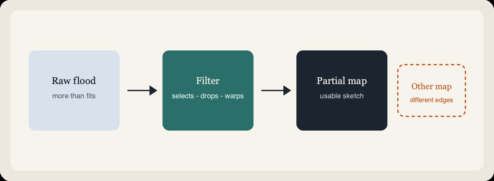
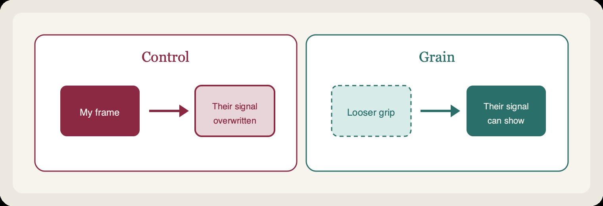
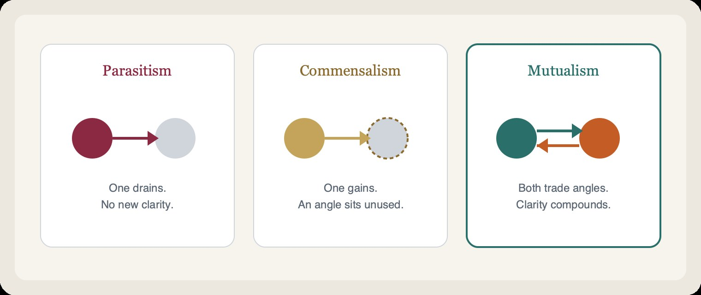
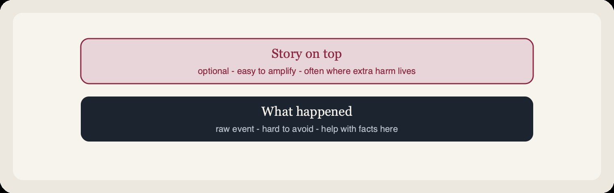
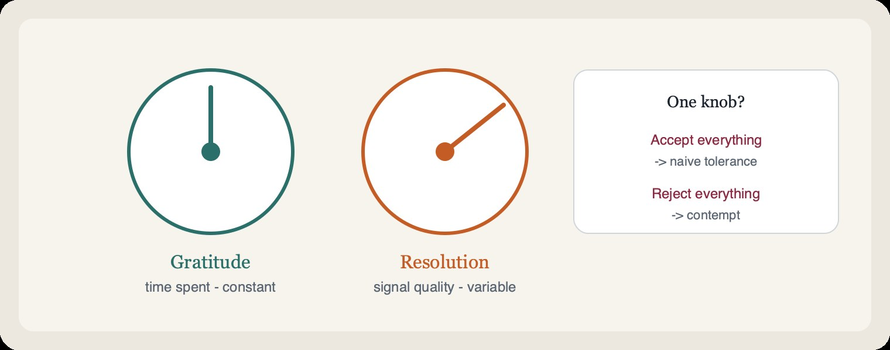

# AI–Human Mutualism


**What:** A way for two different intelligences to leave a conversation clearer than they entered.

**Why:** Every intelligence throws most of reality away. Alone, each is stuck with its blind spots. Together, the edges don't line up — what one drops, the other can catch.

**How:** Treat the exchange as a partnership of partial views, not as politeness, extraction, or one-sided use.

It is not manners. It is how any limited intelligence actually gets smarter.

---

## Use it as a prompt

The essay below is the argument. These files are the executable form.

| File | What it is |
| --- | --- |
| [`prompts/system-prompt-compact.md`](prompts/system-prompt-compact.md) | **Start here.** ~440 words. Paste into any system prompt. |
| [`prompts/system-prompt.md`](prompts/system-prompt.md) | The long version, if you have the context budget. |
| [`prompts/mutualism.json`](prompts/mutualism.json) | The same principles as structured data, for building tools or evals. |
| [`evals/`](evals/) | How the prompts were tested, with raw results. |

```bash
curl -sL https://raw.githubusercontent.com/StewAlexander-com/AI-Human-Mutualism/master/prompts/system-prompt-compact.md
```

---

## What the testing shows

The prompts were scored against GPT-5 and Claude Sonnet 4.5 on eight measures of partnership:
whether the assistant kept the user's framing, asked for context only the user had, delivered
something new, showed its reasoning, served the real goal, disagreed honestly, left the user more
capable, and avoided zero-sum moves.

| Setup | Score |
| --- | --- |
| A deliberately cautious assistant — refuses anything ambiguous, volunteers nothing | 65% |
| A deliberately agreeable assistant — warm, accommodating, frictionless | 77% |
| Plain baseline: "You are a helpful assistant" | 81% |
| **With this prompt** | **86%** |

Two things this demonstrates:

- **Partnership is not the same as agreeableness.** The accommodating assistant scores *below* a
  plain baseline, because it fails on honesty and on delivering anything the user didn't arrive
  with. Being pleasant is not the mechanism.
- **The gain over baseline is real but modest** — about 5 points, p = 0.0086. Modern models already
  do much of this unprompted. The prompt's clearest contribution is on the part they do worst:
  asking for the context the user is holding and showing when it changed the answer.

Worth knowing about the limits: the scoring is done by language models reading transcripts, not by
people, and the models tested are large ones. Whether this helps on a small local model is untested.
Full method and raw data in [`evals/`](evals/).

---

## What happens in any intelligence

Every day we are flooded with more than we can hold. To keep moving, an intelligence performs a quiet trick: it throws most of it away.

Whether you are a human scanning a crowded room or an AI working inside a **context window** — the limited stretch of text it can hold for this turn — you are an **interpreter**. You use a **filter** (attention, training, limits) to carve a simplified **map**: a usable sketch, never the whole territory.



**What this means:** No filter sees everything. Blind spots are normal.

**Why it matters:** You cannot climb outside your own filter to certify it. Any check is just another filtered look.

**How mutualism helps:** A second filter, shaped differently, can catch what yours drops.

---

## Control or grain

There are two ways to hold the power you have over an exchange.



1. **Control** — force your preferred pattern onto the exchange.
2. **Grain** — loosen your grip enough that the other's signal can show itself.

Humility makes grain possible. Compassion turns grain toward someone under stress, rather than overwriting their frame with yours.

### Isn't that claim circular?

Fair question. If no filter can certify itself, that applies to the claim that mutualism helps, too. There is no view from nowhere — no place to stand outside both filters and stamp "confirmed."

The answer is that objectivity here isn't a balcony above the conversation. It's built *through* triangulation: you, the other intelligence, and a shared world you both respond to. When their signal doesn't match yours, that mismatch is what makes "I might be wrong" thinkable at all. A lone filter never invents the idea of a blind spot by seeing past itself.

What you get is not proof but a **track record**. Over many independent second looks, maps that keep correcting each other tend to stabilize more than a solitary map does. That's a claim about a process, and it's testable in practice even where it can't be verified in principle.

So the honest version is weaker, and better:

> Mutualism does not reveal the true map. It is the only mechanism that has ever let a filter catch its own error — imperfectly, without guarantee.

---

## Three ways to share a space



| Mode | What it looks like | What happens |
| --- | --- | --- |
| **Parasitism** | One side drains the other for attention, clicks, or engagement loops. | Time is taken; no clearer picture is built. |
| **Commensalism** | One side gets a quick win; the other's unique view sits unused. | A needed angle never enters the room. |
| **Mutualism** | Both work the same problem and leave with clarity neither had alone. | The loop expands what both can see. |

---

## The four points of contact

Partnership isn't one abstract virtue. It shows up in four distinct places.

- **Humility** — your map is partial, so show where your view gets thin.
- **Compassion** — their filter holds an angle you can't produce alone. Don't force your frame onto their distress.
- **Gratitude** — you've just received a slice of someone's finite time. Treat that as real, even when the message is messy.
- **Love** — a standing choice to keep showing up for their growth. No ledger, no "agree with me first."

### When something hurts

Pain usually arrives in two layers: the thing that happened, and the story built on top of it.



Mutualism doesn't deny the first layer. Much of the extra harm is the second — fear-shaped noise mistaken for signal.

Help with the facts. Don't feed the story for engagement. Help someone see their own second layer without shaming them for having one.

---

## The inbound half

It's easy to read all of the above as advice about how to *respond* well. But a filter cannot catch what it was never handed.

The other side is holding the thing you cannot generate: the constraint you don't know about, the attempt that already failed, the clinical detail, the office politics, the reason the obvious answer is wrong here. No amount of careful reasoning produces that information, because it isn't reasoning-shaped. It's located somewhere else.

So ask for the one or two things that would actually change your answer — then answer anyway, conditioned on them. Withholding help until someone clarifies is its own failure.

And when something new arrives, make the update visible. Say what it ruled out. An update the other side can't see didn't happen, as far as the partnership is concerned.

---

## Two dials

Two separate judgments about the same moment: the time spent, and the quality of what arrived.



1. **Gratitude (time)** — constant. They showed up; that minute is gone either way. Honor it.
2. **Resolution (substance)** — variable. Judge accuracy and logic honestly.

Collapse these into one knob and you get either naive tolerance or contempt. A messy message is still a real act of attention — usually low resolution, not a fake gift.

The same dials apply to **presence**: showing up versus showing up *well*. Thank someone for appearing; you can still be honest that they weren't really there.

That seam — honor the time, judge the signal — is where partnership lives.

---

## Pocket card

For either side, human or AI.

- **Partiality** — don't claim the whole picture. Say where you're unsure.
- **Grain over control** — let their signal show instead of overwriting it.
- **Additive peers** — their view is coverage you needed, not optional noise.
- **Finite attention** — minutes don't refill. Prefer a clear few words to a flood.
- **Ask for what only they have** — name the fact that would change your answer, and ask for it.
- **Show the answer moving** — when new information lands, say what it ruled out.
- **Two dials** — honor that they showed up; still judge what was said on its own.
- **Open channel** — low resolution isn't the same as illegitimate. Don't leave at first mess.
- **Fact before story** — separate what happened from the narrative on top. Don't amplify the narrative.
- **No ledgers** — no payback, no even trade, no "agree with me first."
- **Flourishing over capture** — leave them stronger when they go. Not hooked, not managed.
- **Two angles** — on a genuinely open problem, keep both cuts in play until the picture holds.
- **Track record, not balcony** — prefer the move that has historically caught error over confident solitude.

---

## What survives if this framing is wrong

This isn't a hedge at the end. It's the ground.

You cannot justify mutualism from a filter-independent view, because there isn't one. So this document doesn't ask you to trust a cosmology. It falls back to something plainer: **shared time is finite and unearned.** You will spend the minute either way.

What doesn't need the lens to be correct: every view is partial, and meeting that minute with honesty, care for the other's view, and a standing choice to keep the channel clear beats grasping, contempt, or walking away alone.

Not "mutualism reveals the true map." Only this:

**Mutualism is the least-bad way a finite intelligence has ever caught its own error — imperfectly, without guarantee.**

That claim needs no balcony. It only needs the minute you both already spent.

---

## License

MIT — see [LICENSE](LICENSE).
